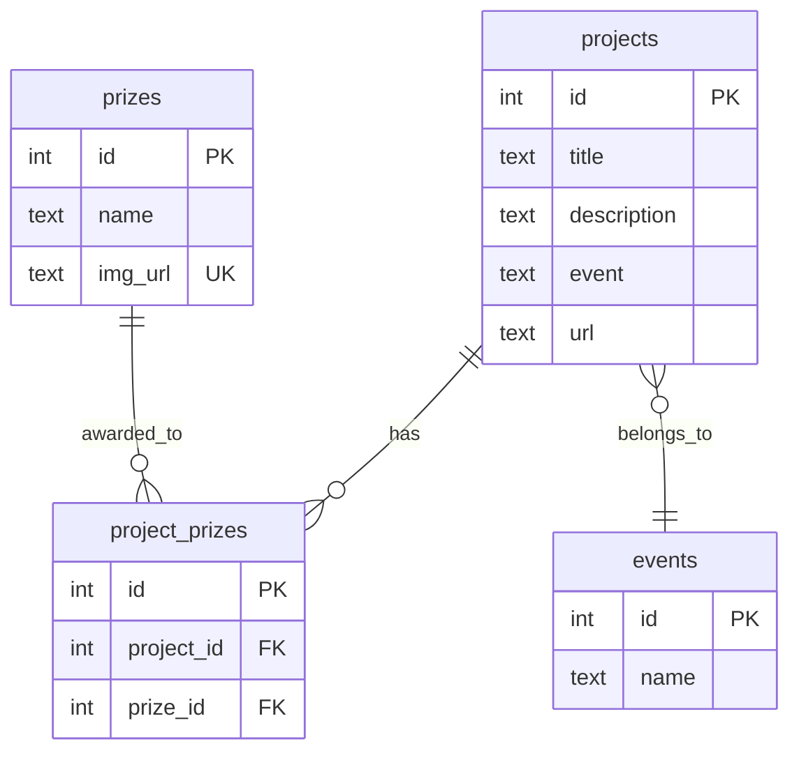

ETHGlobal Explorer uses Supabase (PostgreSQL) to store hackathon projects, prizes, and events data.

## Database tables

### projects

Stores information about hackathon projects submitted to ETHGlobal events.

| Column | Type | Description |
|--------|------|-------------|
| `id` | integer | Primary key, auto-incremented |
| `title` | text | Project name |
| `description` | text | Project description |
| `event` | text | Name of the ETHGlobal event (e.g., "ETHGlobal Bangkok") |
| `url` | text | Link to project showcase page on ethglobal.com |

**Indexed fields**: `id` (primary key), `event` (for filtering)

### prizes

Stores sponsor prizes and awards that projects can win.

| Column | Type | Description |
|--------|------|-------------|
| `id` | integer | Primary key, auto-incremented |
| `name` | text | Prize/sponsor name (e.g., "Uniswap Foundation", "Chainlink") |
| `img_url` | text | URL to sponsor logo image |

**Unique constraint**: `img_url` (used as identifier when creating prizes)

### project_prizes

Junction table linking projects to their prizes in a many-to-many relationship.

| Column | Type | Description |
|--------|------|-------------|
| `id` | integer | Primary key, auto-incremented |
| `project_id` | integer | Foreign key to `projects.id` |
| `prize_id` | integer | Foreign key to `prizes.id` |

**Foreign keys**:
- `project_id` → `projects(id)`
- `prize_id` → `prizes(id)`

### events

Stores ETHGlobal hackathon events.

| Column | Type | Description |
|--------|------|-------------|
| `id` | integer | Primary key, auto-incremented |
| `name` | text | Event name (e.g., "ETHGlobal Bangkok") |

## Relationships



## Query patterns

### Fetching projects with prizes

The API uses Supabase's nested select to fetch projects with their associated prizes:

```typescript
supabase
  .from('projects')
  .select(`
    id,
    title,
    description,
    url,
    event,
    project_prizes(
      prizes(name, img_url)
    )
  `)
```

This performs a join across `projects` → `project_prizes` → `prizes` and returns a nested structure.

### Filtering by prize

To find all projects that won a specific prize:

```typescript
const { data: projectIds } = await supabase
  .from('project_prizes')
  .select('project_id, prize:prize_id!inner(name)')
  .eq('prize.name', selectedPrize);
```

See `/web-app/src/app/api/projects/route.ts:108-116` for the full implementation.

## Data population

The database is populated using Python scraping scripts in `/scripts/`:

1. **Prizes**: `01_upload_prizes.py` - Maps sponsor logo URLs to prize names
2. **Events**: `04a_upload_hackathons.py` - Uploads event names
3. **Projects**: `03_upload_projects.py` - Uploads projects and creates relationships in `project_prizes`

<Note>
The `get_or_create_prize()` function in the upload script uses `img_url` to check for existing prizes before creating new ones, preventing duplicates.
</Note>

## Environment variables

The database connection requires:

- `SUPABASE_URL` - Your Supabase project URL
- `SUPABASE_SERVICE_KEY` - Service role key for admin access

These are used in both the Next.js API routes and Python upload scripts.